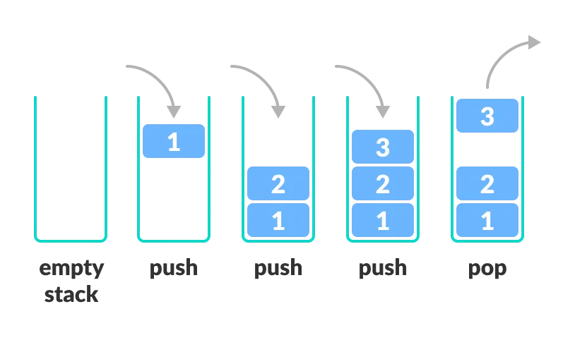

# Stack

Keeping track of information passed into a program is essential to guarantee that variables are consistent and everything is executed in the correct order. Using a stack is a great way to make sure that code is executed as expected like if there is nested functions in code.

A stack in Python is made by making a list and using the `append()` or `pop()` functions to add or remove items from the list. More details on those functions will be described further in a future section. 

Below is a simple example of a stack. When using the `pop()` function mentioned above the string `'last'` will be removed first.

```python
stack = ['first', 'last']
```

## Last in First Out - Bucket Visualization

A stack is not like a line at a grocery store where the first person who arrives gets checked out first and anyone who arrives behind that person is helped afterwards. A stack is more like adding items to a bucket. Below is an image that demonstrates how to visualize a stack in coding.



The picture above shows different tasks or items being added to a bucket which is then finally removed. When taking items from a bucket we cannot take out the first item that was placed within the bucket until we have taken out the items that were put on top of it.

This bucket visualization is exactly how stacks work having the last item that was placed within the bucket removed first until the stack is empty once again.

## Nested Functions 

Using a stack is essential when nested functions are being used in coding so that each function is executed in the correct order.

```python
def fun_A(data):
    # code
    fun_B(data)
    fun_A(data)
    return result

def fun_B(data):
    # code
    fun_C(data)
    return result

def fun_C(data):
    #code
    return result

```

Above is a list of `fun A-C` definitions that call each other or itself. The stack is used here to make sure that the data passed through each function has be updated to the desired state before being passed into the next function.

If the `fun_A` is called then `fun_A` will be put into a stack like the bucket example above and will not be removed until everything above `fun_A` has been executed. Below shows steps to how the bucket is filled and emptied throughout the process of calling the function (the bottom of the table represents the bottom of the bucket):

|START|ADD  |ADD  |ADD  |REM  |REM  |ADD  |REM  |REM\END|
|-----|-----|-----|-----|-----|-----|-----|-----|-----|
|     |     |     |     |     |     |fun_C|     |     |
|     |     |     |fun_C|     |     |fun_B|     |     |
|     |     |fun_B|fun_B|fun_B|     |fun_A|     |     |
|     |fun_A|fun_A|fun_A|fun_A|fun_A|fun_A|fun_A|     |


The table shows the steps that were taken to make sure that each function was executed in the correct order. If you follow the call of functions in the code snippet you should be able to see why I added each function where I did. I skipped a few steps with the 7th column because it was just going to repeat the previous columns since `fun_A` was called again.

Knowing how functions are called and organized is good knowledge to have so that you can better understand how your system runs your code. Although the computer does this on its own I think it's a great way to explain the stack.

## Adding and Removing from a Stack

Adding and removing from a stack is very simple in Python. First I will explain the `append()` function.
### Append

The `append()` function is used when wanting to add an item to the end of a list. Here is a code example:

```python
stack = []

stack.append(1) # [1]
stack.append(2) # [1, 2]
stack.append(3) # [1. 2, 3]
```

This function had a O(1) time complexity so it is a very efficient way to add an item to the end of a list.

Now I will explain the `pop()` function:

### Pop

The `pop()` function is used when wanting to remove an item at the end of a list. Here is a code example using the previous stack:

```python
stack = [1, 2, 3]

stack.pop() # [1, 2]
stack.pop() # [1]
``` 

This function had a O(1) time complexity so it is a very efficient way to remove the last item from a list.

When using the `pop()` function you can also store the removed value into a variable or use it as a conditional value. For example:

```python
stack = [1, 2, 3]

removed_value = stack.pop() # removed_value = 3

#stack now equals [1, 2]

if stack.pop() != removed_value: # 2 does not equal 3
    print('Not the same') # this would be printed

# because 3 was removed first, the second time we called pop() the number 2 was then used as the value in the above conditional along with the variable we created with the first pop()
```

### Append and Pop

We can of course use append and pop in the same code snippet. Can you tell why the following final stack value would be `[1,3,6]`?

```python
stack = []

stack.append(1)
stack.append(2)
stack.pop()
stack.append(3)
stack.append(4)
stack.append(5)
stack.pop()
stack.pop()
stack.append(6)
```

## Example : Balanced Equations

In the example below, we will write a simple function that will check whether a set of paranthesis is balanced meaning that every "(" has exactly one corresponding ")" using a stack. Study this code and walk through the different scenarios until this makes sense to you.

```python
def balanced_equation(equation):
    stack = []
    for term in equation:
        if term == '(':
            stack.append(term)
        elif term == ')':
            if len(stack) == 0:
                return False
            else:
                stack.pop()
        else: continue
    return len(stack) == 0


print(balanced_equation('()'))                  # True
print(balanced_equation('((())'))               # False
print(balanced_equation('(6*(8+7*(28**(3))))')) # True
print(balanced_equation('(7+8**(6)*(87-21)'))   # False

```

## Problem to Solve : Text Editor

Write a program that functions like a text editor where you can add text and undo text depending on whether the user types the word `"add <text>"`, `"undo"`, or `"quit"`.

If the user types `"add <text>"` then that text should be added to a string so that the overall text can be displayed to the user. You will also need to think of a way to store in memory what text was added in which order so that the `"undo"` key word can remove the latest text added.

If the user types `"undo"` then the latest text added should be removed. The text that was removed should be displayed along with the updated string every time `"undo"` is entered by the user. In the case where there is nothing to remove, the program should inform the user that there is nothing to remove.

If the user types `"quit"` then the program should stop and display the final text that was inputted.

If the user enters something that is not within the keywords above then the program should tell them that it is invalid and to try again.

### Test Cases:

- If the user types `"add Once upon a time"` then the text should be equal to `"Once upon a time"`

- Along with the previous code if the user types `"add there was a mystical wizard named Steven."` then the text should be equal to `"Once upon a time there was a mystical wizard named Steven."`.

- Along with the previous code if the user types `"undo"` then the text should now be `"Once upon a time"`.

- Type `"quit"` then the program should stop and print the final state of the text.

- If the user starts a new text and the very first thing they type is `"undo"` then the program should tell the user that there is nothing to undo and then should ask for the next prompt.

- If the user types in anything other than the 3 keywords then the program should tell him that is an invalid input.

### Consider using:

- List slicing
- The `"startswith()"` function

You can check your code with the solution here: [Solution](python_examples/stack_text_editor.py)

[Back to Welcome Page](welcome.md)


