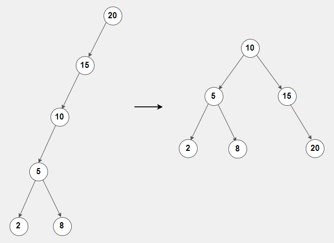

# Trees

Trees are another way to sort data similarly to linked lists where nodes are pointing to each other, but unlike linked lists nodes can point towards multiple other nodes rather than just one. When trees are used and organized in the correct manner they can have great performance like O(log(n)) which means that it cuts the iterations to find a value in half!

Trees are made up of a single root node and many branches. The root node is found at the top of the tree which is the beginning of the tree and the children or branches stem out of it. 

When a node branches out to a node below it the nodes are called parent and child nodes respectively. When the end of a branch is reached it is called a leaf node. The height of a tree is determined by the number of nodes it takes to get to a specific node including the beginning node.


The height from the root node to a leaf node would be 4 in this example, but you could also classify the height from the root node to the first parent node which would just make it a height of 2.

## Binary Search Trees

Organizing a tree into a binary search tree is the way that the efficiency of finding nodes is O(log(n)) because it gets through the nodes in half the time.

As the word binary denotes, each node in a binary tree can only have two branches coming out of it. The way that we sort the data is if the value that is being added is less than the value on the current node then it will be moved to the left and compared with the next node. Once the value reaches a leaf it will be made as the new leaf. 

If the the value is greater than a value it will be moved to the right and follow the same process.

### Balanced Trees

To be able to achieve the O(log(n)) performance the tree must be balanced meaning that both sides of the tree are close to the same length dividing the data as close to equally in half as possible. When you have overly skewed trees the performance just because O(n) functioning just like a linked list.



## Recursion in Trees

One of the most efficient ways to navigate a tree is to use recursion. If you are not too familiar with recursion I would definitely encourage you to look more into it, but I know you will also learn a few things from the examples that I will be sharing. Be patient with yourself though because it at least took me a while to wrap my head around it.

### Navigating a Tree

To begin navigating a tree we first need a class describing a node. Here is a simple class that outlines how the nodes will work.

```python
class Node:

    def __init__(self, data):
        
        self.data = data
        self.left = None
        self.right = None
```

Each node will have a value, as well as pointers towards their left and right nodes whether they are None or an actual node.

We also need to initialize the tree by creating the following class

```python

class Binary_Search_Tree:

    def __init__(self):
        
        self.root = None

```

The beginning of a tree object is just to create the self.root definition and assign it to None. It is currently not set to a node from the Node class.

### Inserting Values

To insert values into the tree we can create the following functions within the class

```python

# to insert we use the callable function and if the tree is not empty then we will call the inner _insert function
def insert(self, data):

    # if tree is empty
    if self.root is None:
        self.root = Node(data)

    else:
        self._insert(data, self.root)

# inner function to process the insert of a nonempty tree
def _insert(self, data, node):

    # If there is a duplicate we basically just ignore it
    if data == node.data:
        node = Node(data)

    # checks to see whether the data should go to the left or right branch of the current node
    elif data < node.data:
        # if left branch empty assign a new node to the left branch
        if node.left is None:
            node.left = Node(data)
        else:
            # recursion
            self._insert(data, node.left)
    else:
        # if right branch empty assign a new node to the right branch
        if node.right is None:
            node.right = Node(data)
        else:
            # recursion
            self._insert(data, node.right)

```

The code above uses two function to insert a value into the tree. The `insert` is the only one that will be called outside of the class. Python does not identity public and private function calls within a class, but the `_` before the `_insert` function shows that it will only ever be called with the class when the `insert` function is called.

I also marked two placed where recursion is happening within the function. Recursion at a low level means that the current function calls itself again with different data. In this scenario it allows the function to keep shifting through nodes until it finds the opening for the new node to be inserted. If you notice, each time the `_insert` function is called recursively it passes through `root.left` or `root.right` so that when it runs again we are deeper into the tree until we find the empty spot.

### Finding Values

The following functions will determine whether a pass through value is within the tree. The function uses a special method similar to the `__init__` special method that defines the initial object definitions. The `__contains__` special method allows code like `print(<item> in <object>)`  to be used outside of the class with the `in` key word.

```python

# special method
def __contains__(self, data):

    return self._contains(data, self.root)


def _contains(self, data, node):

    # value not in list
    if node == None:
        return False
    
    # found value
    if data == node.data:
        return True
    
    # checks to see if the data is in the left or right branch
    elif data < node.data:
        return self._contains(data, node.left)
    else:
        return self._contains(data, node.right)

```

Because the tree is a Binary Search Tree we know how the data is sorted so if the value is less then the node it must be on the left side of the tree etc. that way we do not have to iterate through the whole tree to find the value. We can be certain that if we hit a dead end the value is not in the tree.

### Navigating a Tree

Below are two different sets of functions that either traverse through the tree from least value to most value (forward) or most value to least value (backward).

Both functions use a `yield` key word which works similarly to the `return` keyword, but rather than forgetting the state of the data after returning a value like when using `return` the `yield` will create what is called a generator function so that the next time it is called it will remember the previous state of the variable.

```python

def yield_list(lst):
    while lst:
        yield lst.pop()

# Create a list
my_list = [1, 2, 3, 4, 5]

# Create a generator object by calling the generator function
gen = yield_list(my_list)

# Iterate over the generator object to yield values
for item in gen:
    print(item) # will print 5 4 3 2 1

```

Here is an example of a simple yield function. A generator object is created called `gen` and the for loop will print every popped value from the list after it is retrieved then go back into the yield_list function to find the next value.

#### Going Forward

This function has a special method like `__commit__`, but it allows the values being found to be printed in a for loop like this: `for x in <tree_name>`. 

```python

# special method
def __iter__(self):

    yield from self._traverse_forward(self.root)

def _traverse_forward(self, node):

    if node is not None:
        yield from self._traverse_forward(node.left)
        yield node.data
        yield from self._traverse_forward(node.right)

```
The function uses `yield from` which just means that it is using the generator created by a different call of a function. We begin generating from the far left of the tree and then move right.

#### Going Backward

This function also has a special method named `__reversed__`. This method is very similar to `__iter__` but it is used to show that we are going through the list backwards and is used like this: `for x in reversed(<tree_name>)`

```python

# special method
def __reversed__(self):

    yield from self._traverse_backward(self.root)

def _traverse_backward(self, node):

    if node is not None:
        yield from self._traverse_backward(node.right)
        yield node.data
        yield from self._traverse_backward(node.left)

```

The function performs the same as the forward traversal but it starts on the right side.

### Finding Height of Tree

The final function finds the height of a tree by finding the longest trace of edges starting from the root.

```python

def get_height(self):

    # tree is empty
    if self.root is None:
        return 0
    else:
        return self._get_height(self.root)
    

def _get_height(self, node):

    # current node is empty
    if node is None:
        return 0
    else:

        # compares height of each branch to find tallest trace of edges
        left_height = self._get_height(node.left)
        right_height = self._get_height(node.right)
        return max(left_height, right_height) + 1

```

Here is a link to find the classes and functions in one file: [Tree Classes and Functions](python_examples/tree_classes_functions.py)

## Example : Test Tree Functions

The following example runs through the functions and shows how to use each of them with the special methods that were listed above.

```python

# ^^^ paste classes and functions above ^^^

# Create a binary search tree
tree = Binary_Search_Tree()

# Insert some elements
elements = [8, 3, 10, 1, 6, 14, 4, 7, 13]
for element in elements:
    tree.insert(element)

# Check membership
print(6 in tree)  # Output: True
print(12 in tree)  # Output: False

# Print elements in forward order
print('Forward order:')
for item in tree:
    print(item, end=', ')
print()

# Print elements in reverse order
print('Reverse order:')
for item in reversed(tree):
    print(item, end=', ')
print()

print('Tree Height: ')
print(tree.get_height())

```

## Problem to Solve : Factor Tree

Create `_factors` functions that will take any integer and return a tree that is made up of the factors of that number. In order to use the `_factors` function `factors` will need to be called first which I included below. 

These functions will exist outside of the `Binary_Search_Tree` and `Node` classes.

Because there can be repeats in the factors you will also need to edit the `_insert` function to accept duplicates.

Here is the `factors` function to get you started:

```python

def factors(num):

    tree = Binary_Search_Tree()
    _factors(num, tree)
    return tree

```

Once the tree is finished have the result be printed in the reverse order.

### Test Cases:

- `factor_tree = factors(860): 43, 5, 2, 2`
- `factor_tree = factors(15000): 5, 5, 5, 5, 3, 2, 2, 2`
- `factor_tree = factors(30): 5, 3, 2`
- `factor_tree = factors(7654321): 402859, 19`

### Solution
You can check your code with the solution here: [Solution](python_examples/tree.py)

[Back to Welcome Page](welcome.md)


